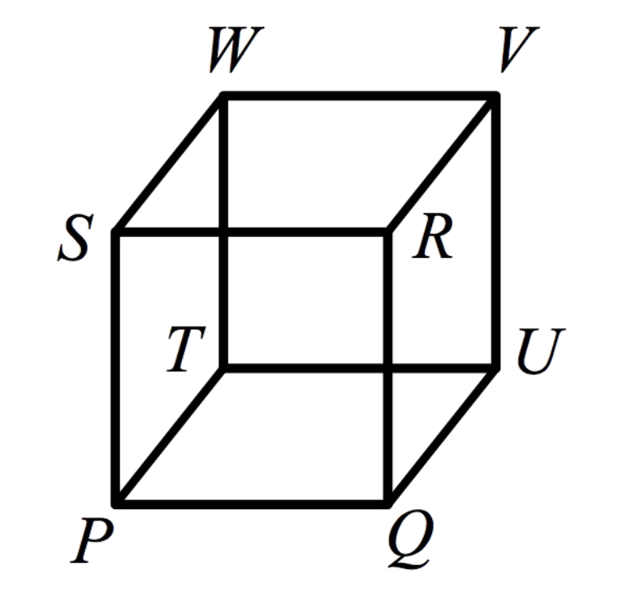

# The Necker Cube in VSA

In our <b>Necker Cube</b> program, the candidate solution state <i>x</i>
is initially just the vector sum of the representations of all possible 
solution components:

<i>x</i>0 = <i>Pf + Qf + Rf +  
Sf + Tb + Ub + Vb + Wb  + 
Pb + Qb + Rb + Sb + Tf + 
Uf + Vf + Wf</i>

where the subscripts stand for <i>f</i>orward and <i>b</i>ackward.
As usual for VSA, each term of the sum is a vector of high dimensionality with 
elements chosen randomlyfrom the set {-1,+1}. The constraints (evidence) <i>w</i> 
can then be represented as the sum of the pairwise products of  
mutually-consistent components:

<i>w = Pf &otimes;Qf  + Pf &otimes;Rf  + 
Pf &otimes;Sf  +
Pf &otimes;Tb + 
Pf &otimes; Ub + ... + Wb&otimes;Pf + 
Wb&otimes;Qf  + ... + Wb&otimes;Ub + 
Wb&otimes;Vb</i>  

The update of <i>x</i> from <i>w</i> can likewise be implemented by using the binding 
(elementwise product) operator &otimes;.  If any vertex/position vector 
(e.g. <i>Pf</i>)
has greater 
representation in <i>x</i> than others do, multiplying this consistency vector <i>w</i> by the 
state vector <i>x</i> has the effect of &ldquo;unlocking&rdquo;  (unbinding) the components of <i>w</i> 
consistent with this evidence.  As an example, consider the extreme case in 
which <i>x</i> contains only the component <i>Pf</i>:

<i>xt&otimes;w= 
Pf  &otimes;(Pf &otimes;Qf  + 
Pf &otimes;Rf  + Pf &otimes;Sf  + 
Pf &otimes;Tb + Pf &otimes;Ub + 
... + Wb&otimes;Pf  + Wb&otimes;Qf  + 
... +Wb&otimes;Ub + Wb&otimes;Vb) = 
Qf  + Rf  + Sf  + Tb + 
Ub + Vb + Wb + noise</i>

