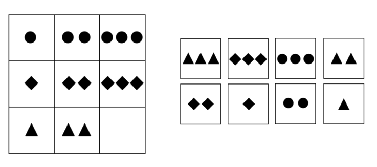

# Raven's Progressive Matrices in VSA

Our <b>Raven's Matrices</b> program is a simplified version of the 
[spiking neural model](http://www.sciencedirect.com/science/article/pii/S0160289613001542)
devloped by Rasmussen and Eliasmith, with a GUI front-end. Our version works as follows:

To encode the transformation vector for the rows (left-to-right processing) of 
the Raven's Matrix above, we compute the vector sum of the pairwise transformations 
between cells. Using the abbreviations <b><i>S</i></b>hape, <b><i>N</i></b>umber, <b><i>C</i></b>ircle, 
<b><i>D</i></b>iamond, <b><i>T</i></b>riangle, on<b><i>E</i></b>, t<b><i>W</i></b>o, th<b><i>R</i></b>ee, and
P() for permutation, this sum is:

&lt;Row&gt; =  (<i>S</i>&otimes;<i>C</i> + <i>N</i>&otimes;<i>E</i>) &otimes;P(<i>S</i>&otimes;<i>C</i> + <i>N</i>&otimes;<i>W</i>) + (<i>S</i>&otimes;<i>C</i> + <i>N</i>&otimes;<i>W</i>) &otimes; P(<i>S</i>&otimes;<i>C</i> + <i>N</i>&otimes;<i>R</i>) +
(<i>S</i>&otimes;<i>D</i> + <i>N</i>&otimes;<i>E</i>) &otimes; P(<i>S</i>&otimes;<i>D</i> + <i>N</i>&otimes;<i>W</i>) + (<i>S</i>&otimes;<i>D</i> + <i>N</i>&otimes;<i>W</i>) &otimes; P(<i>S</i>&otimes;<i>D</i> + <i>N</i>&otimes;<i>R</i>) +  
(<i>S</i>&otimes;<i>T</i> + <i>N</i>&otimes;<i>E</i>) &otimes; P(<i>S</i>&otimes;<i>T</i> + <i>N</i>&otimes;<i>W</i>) 

For the columns (top-to-bottom processing) the transformation vector is:

&lt;Column&gt; =  (<i>S</i>&otimes;<i>C</i> + <i>N</i>&otimes;<i>E</i>) &otimes; P(<i>S</i>&otimes;<i>D</i> + <i>N</i>&otimes;<i>E</i>) + (<i>S</i>&otimes;<i>D</i> + <i>N</i>&otimes;<i>E</i>) &otimes; P(<i>S</i>&otimes;<i>T</i> + <i>N</i>&otimes;<i>E</i>) +
(<i>S</i>&otimes;<i>C</i> + <i>N</i>&otimes;<i>W</i>) &otimes; P(<i>S</i>&otimes;<i>D</i> + <i>N</i>&otimes;<i>W</i>) + (<i>S</i>&otimes;<i>D</i> + <i>N</i>&otimes;<i>W</i>) &otimes; P(<i>S</i>&otimes;<i>T</i> + <i>N</i>&otimes;<i>W</i>) +
(<i>S</i>&otimes;<i>C</i>+ <i>N</i>&otimes;<i>R</i>) &otimes; P(<i>S</i>&otimes;<i>D</i> + <i>N</i>&otimes;<i>R</i>)     
To get the row successor to the two-triangle cell, we multiply the VSA
representation of this cell by the row-transform vector and take the inverse
permutation of the result:

P-1((<i>S</i>&otimes;<i>T</i>+ <i>N</i>&otimes;<i>W</i>)  &otimes;&lt;Row&gt;) = 
P-1(<i>S</i>&otimes;<i>T</i>&otimes;&lt;Row&gt;  +  <i>N</i>&otimes;<i>W</i>&otimes;&lt;Row&gt;) = 
P-1(P(<i>S</i>&otimes;<i>T</i> +  <i>N</i>&otimes;<i>W</i>) + P(<i>S</i>&otimes;<i>C</i> + <i>N</i>&otimes;<i>R</i>) + P(<i>S</i>&otimes;<i>D</i> + <i>N</i>&otimes;<i>R</i>) + <i>noise</i>) = 
(<i>S</i>&otimes;<i>T</i> +  <i>N</i>&otimes;<i>W</i>) + (<i>S</i>&otimes;<i>C</i> + <i>N</i>&otimes;<i>R</i>) + (<i>S</i>&otimes;<i>D</i> + <i>N</i>&otimes;<i>R</i>) + <i>noise</i>

To get the column successor to the three-diamond cell, we multiply the VSA 
representation of this cell by the column-transform vector and take the inverse 
permutation:

P-1((<i>S</i>&otimes;<i>D</i>+ <i>N</i>&otimes;<i>R</i>)  &otimes;&lt;Column&gt;) = 
P-1(<i>S</i>&otimes;<i>D</i>&otimes;&lt;Column&gt;  + <i>N</i>&otimes;<i>R</i>&otimes;&lt;Column&gt;)= 
P-1(P(<i>S</i>&otimes;<i>T</i> + <i>N</i>&otimes;<i>E</i>) + P(<i>S</i>&otimes;<i>T</i> + <i>N</i>&otimes;<i>W</i>) + P(<i>S</i>&otimes;<i>D</i> + <i>N</i>&otimes;<i>R</i>) + <i>noise</i>) = 
(<i>S</i>&otimes;<i>T</i> + <i>N</i>&otimes;<i>E</i>) + (<i>S</i>&otimes;<i>T</i> + <i>N</i>&otimes;<i>W</i>) + (<i>S</i>&otimes;<i>D</i> + <i>N</i>&otimes;<i>R</i>) + <i>noise</i>

Hence the overall evidence for the contents of the missing cell at lower-right 
is the vector:

(<i>S</i>&otimes;<i>T</i> +  <i>N</i>&otimes;<i>W</i>) + (<i>S</i>&otimes;<i>C</i> + <i>N</i>&otimes;<i>R</i>) + (<i>S</i>&otimes;<i>D</i> + <i>N</i>&otimes;<i>R</i>) + (<i>S</i>&otimes;<i>T</i> + <i>N</i>&otimes;<i>E</i>) + (<i>S</i>&otimes;<i>T</i> + <i>N</i>&otimes;<i>W</i>) + (<i>S</i>&otimes;<i>D</i> + <i>N</i>&otimes;<i>R</i>) + <i>noise</i>= 
3<i>S</i>&otimes;<i>T</i> + 2<i>S</i>&otimes;<i>D</i> + <i>S</i>&otimes;<i>C</i> + 3<i>N</i>&otimes;<i>R</i> + 2<i>N</i>&otimes;<i>W</i>+ <i>N</i>&otimes;<i>E</i> + <i>noise</i>

This vector indicates that the most likely element in the missing cell has the 
shape triangle and the number three &mdash; i.e., its dot product with the vector 
(<i>S</i>&otimes;<i>T</i> + <i>N</i>&otimes;<i>R</i>), meaning three triangles,
is higher than its dot product with any of the vectors for the eight possible solutions. 
